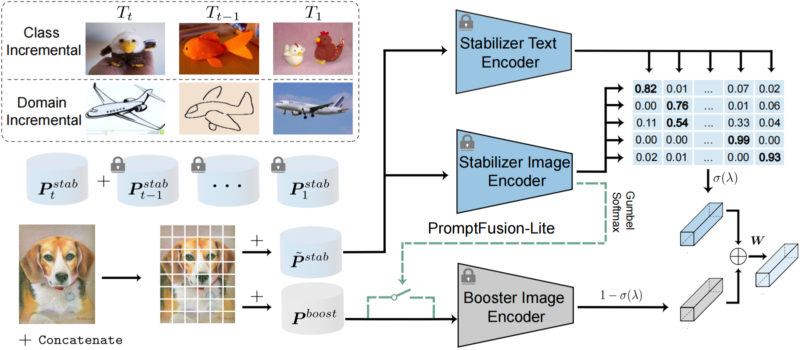

# PromptFusion: Decoupling Stability and Plasticity for Continual Learning

 :bookmark_tabs:[`Paper`](https://arxiv.org/abs/2303.07223) 
 :black_nib:[`BibTex`](#black_nib-citation) 

**Authors**: Haoran Chen, [Zuxuan Wu](https://zxwu.azurewebsites.net/), Xintong Han, Menglin Jia, Yu-Gang Jiang

## :mag: Overview
To address the stability-plasticity dilemma of continual learning, we propose a prompt-tuning-based method termed PromptFusion to enable the decoupling of stability and plasticity. Specifically, PromptFusion consists of a carefully designed Stabilizer module that deals with catastrophic forgetting and a Booster module to learn new knowledge concurrently. Furthermore, to address the computational overhead brought by the additional architecture, we propose PromptFusion-Lite which improves PromptFusion by dynamically determining whether to activate both modules for each input image.
<p align="center">
  
<be>
</p>

## :wrench: Usage
### install
``` shell
git clone https://github.com/HaoranChen/PromptFusion.git
cd PromptFusion
```
### run experiment
1. Edit the json files for global settings and hyperparameters.
2. Run:
   
    ```bash
    python main.py --config=./config/[MODEL NAME].json
    ```

## :clap: Acknowledgement
Part of this repository is built upon [LAMDA-PILOT](https://github.com/sun-hailong/LAMDA-PILOT), thanks for the well-organized codebase.

## Contact
Feel free to contact us if you have any questions or suggestions 
Email: chenhran21@m.fudan.edu.cn

## :black_nib: Citation
If you use our code in this repo or find our work helpful, please consider giving a citation:

```
@article{promptfusion,
  title={Promptfusion: Decoupling stability and plasticity for continual learning},
  author={Chen, Haoran and Wu, Zuxuan and Han, Xintong and Jia, Menglin and Jiang, Yu-Gang},
  journal={ECCV},
  year={2024}
}
```
